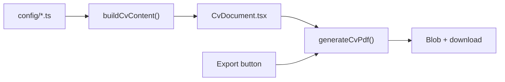

# CV PDF Export

## Approach

Generate the PDF **client-side** with [`@react-pdf/renderer`](https://react-pdf.org/) (single new dependency). The library supports programmatic layout, multi-page documents, and `pdf(...).toBlob()` for download — without relying on the dashboard’s gamified UI styling.

The PDF module lives in a **separate `frontend/src/cv/` folder**, decoupled from dashboard components and CSS Modules. Config data is transformed into CV-shaped content first, then rendered.

**Lazy-load** the PDF library on button click (`await import('@react-pdf/renderer')`) so the initial dashboard bundle stays unchanged.



## Content mapping (config → professional CV)

Source files: [`profile.ts`](frontend/src/config/profile.ts), [`metrics.ts`](frontend/src/config/metrics.ts), [`capabilities.ts`](frontend/src/config/capabilities.ts), [`projects.ts`](frontend/src/config/projects.ts), [`logs.ts`](frontend/src/config/logs.ts), [`interests.ts`](frontend/src/config/interests.ts).

Sections render in this fixed order:

1. **Header** — name, role, location, contact links
2. **Summary**
3. **Technical Skills**
4. **Selected Projects**
5. **Core Competencies**
6. **Professional Experience**
7. **Certifications**
8. **Education**
9. **Interests**

| CV section | Source | Notes |
|---|---|---|
| Header | `profile` + new contact fields | Name, role, location, email, LinkedIn, GitHub |
| Summary | `profile` | 2–3 sentences from `yearsOfExperience`, `primaryRole`, `currentFocus` |
| Technical skills | `metrics` | Group by `category`; list labels only (drop level/trend bars) |
| Selected projects | `projects` | Name, duration, summary, responsibilities, `architectureSummary` as tech stack |
| Core competencies | `capabilities` | Label + description bullets |
| Professional experience | `activityLogs` where `category === 'work'` | Chronological (newest first); format dates from `timestampLabel` |
| Certifications | `activityLogs` where `category === 'certification'` | |
| Education | `activityLogs` where `category === 'education'` | |
| Interests | `interests` | One compact line per item (no emoji icons) |

**Omit from PDF:** `status`, skill percentages/trends, `backendFocus` placeholder text (`N/A (Static hosting...)`), broken `capabilityIds` references, dashboard panel titles.

**Unicode:** Register a standard font (e.g. Helvetica or Open Sans via `@react-pdf/renderer` font registration) so accented characters in “António” render correctly.

## Profile extension

Extend [`DeveloperProfile`](frontend/src/models/types.ts) and [`profile.ts`](frontend/src/config/profile.ts) with contact fields you will provide:

```ts
email: string
linkedinUrl?: string
githubUrl?: string
websiteUrl?: string
```

During implementation, you’ll supply the actual values for these fields.

## New files

| File | Purpose |
|---|---|
| [`frontend/src/cv/buildCvContent.ts`](frontend/src/cv/buildCvContent.ts) | Pure function: imports config, returns typed `CvContent` struct (sections, sorted entries) |
| [`frontend/src/cv/CvDocument.tsx`](frontend/src/cv/CvDocument.tsx) | `@react-pdf/renderer` document — professional layout: serif/sans hierarchy, section headings with rules, bullet lists, 2-column skills grid |
| [`frontend/src/cv/cvStyles.ts`](frontend/src/cv/cvStyles.ts) | PDF StyleSheet (margins, font sizes, spacing — independent of dashboard theme) |
| [`frontend/src/cv/generateCvPdf.ts`](frontend/src/cv/generateCvPdf.ts) | `downloadCvPdf()`: lazy-imports renderer, builds blob, triggers `<a download="Antonio-Alvarenga-CV.pdf">` |
| [`frontend/src/cv/__tests__/buildCvContent.test.ts`](frontend/src/cv/__tests__/buildCvContent.test.ts) | Unit tests for sorting, filtering, omitting gamified fields |

## PDF layout (professional, ~2 pages)

```
┌─────────────────────────────────────────────┐
│  ANTÓNIO DE ALVARENGA                       │
│  Back-End Engineer · Lisbon, Portugal       │
│  email · linkedin · github                  │
├─────────────────────────────────────────────┤
│  SUMMARY                                    │
│  7+ years... REST APIs and Distributed...   │
├─────────────────────────────────────────────┤
│  TECHNICAL SKILLS                           │
│  Backend: Python, FastAPI, Flask, ...       │
│  DevOps: Docker & Kubernetes, ...           │
├─────────────────────────────────────────────┤
│  SELECTED PROJECTS                          │
│  ORYXLABS - Datarig360 (UAE) · 6 Months   │
│  • Led API development                      │
│  Stack: Python FastAPI, React               │
│  ...                                        │
├─────────────────────────────────────────────┤
│  CORE COMPETENCIES                          │
│  • API Design — ...                         │
│  • Test Driven Development — ...            │
├─────────────────────────────────────────────┤
│  PROFESSIONAL EXPERIENCE                    │
│  Senior Software Engineer    Jul 2022       │
│  Software Engineer           Feb 2022       │
│  ...                                        │
├─────────────────────────────────────────────┤
│  CERTIFICATIONS                             │
│  Microsoft Azure AI Fundamentals · Jan 2026 │
├─────────────────────────────────────────────┤
│  EDUCATION                                  │
│  Masters in Mechanical Engineering · 2016   │
│  ...                                        │
├─────────────────────────────────────────────┤
│  INTERESTS                                  │
│  Sports: Padel, Sumo, Football, ...         │
│  ...                                        │
└─────────────────────────────────────────────┘
```

Typography: 10–11pt body, 18–22pt name, dark text on white, subtle horizontal rules between sections, consistent 12mm margins (A4).

## UI change

Add an **Export** button to [`Header.tsx`](frontend/src/components/Header.tsx):

- Calls `downloadCvPdf()` on click
- Shows brief loading/disabled state while generating
- Accessible label: `aria-label="Download CV as PDF"`
- Minimal styling in [`Header.module.css`](frontend/src/components/Header.module.css) — a plain button, not dashboard-themed chrome

Update [`Header.test.tsx`](frontend/src/components/Header.test.tsx) to assert the button renders and triggers download (mock `downloadCvPdf`).

## Dependency

Add to [`frontend/package.json`](frontend/package.json):

```json
"@react-pdf/renderer": "^4.x"
```

Justified under constitution’s dependency rule: no browser-native API produces a styled, downloadable PDF programmatically; this is the standard React solution and will be lazy-loaded.

## Test plan

1. `npm test` — `buildCvContent` unit tests pass (work/education/cert filtering, date ordering, skills grouping)
2. Header test — Export button present, click invokes mocked download
3. Manual — click Export in dev server, verify PDF opens with all sections, accents render, filename is `Antonio-Alvarenga-CV.pdf`

## What I need from you at implementation time

Provide the contact field values for `profile.ts`: **email** (required), and optionally **LinkedIn**, **GitHub**, and **website** URLs.
