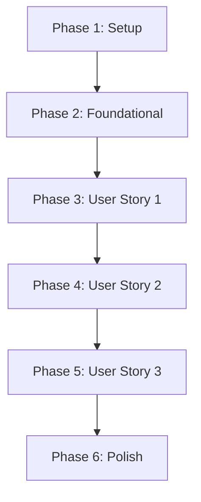

# Tasks: Initial feature – Systems Dashboard Portfolio

This document outlines the implementation tasks for the **Initial feature – Systems Dashboard Portfolio** feature, organized by user story and priority.

## Implementation Strategy

The implementation will follow an MVP-first approach, delivering each user story as an independently testable and deployable increment.

- **MVP Scope**: The minimum viable product will consist of Phase 1 (Setup), Phase 2 (Foundational), and Phase 3 (User Story 1). This delivers the core dashboard experience.
- **Incremental Delivery**: Subsequent user stories (Phases 4 and 5) will be implemented as follow-on deliverables.
- **Parallelism**: Tasks marked with `[P]` can be worked on in parallel within their respective phases.
- **TDD Enforcement**: Implementation tasks are preceded by a test creation task to ensure the "Red-Green-Refactor" workflow mandated by the Constitution.

## Dependencies

The phases are designed to be completed in sequence.

---

## Phase 1: Setup

- **Goal**: Initialize the project structure and install dependencies.
- **Independent Test**: The Vite development server starts successfully.

- [X] T001 Initialize a new React + TypeScript project using Vite in the `frontend/` directory.
- [X] T002 Install primary dependencies: `react`, `react-dom`.
- [X] T003 Install development dependencies: `vitest`, `@testing-library/react`, `eslint`, `prettier`.
- [X] T004 Configure ESLint and Prettier for the project.
- [X] T005 Create the basic directory structure inside `frontend/src/`: `components`, `pages`, `models`, `config`.

---

## Phase 2: Foundational

- **Goal**: Define data models and create static configuration files.
- **Independent Test**: Data models are defined and can be imported into components.

- [X] T006 [P] Define TypeScript interfaces for all data models (`DeveloperProfile`, `SkillMetric`, `Project`, `CapabilityNode`, `ActivityLogEntry`) in `frontend/src/models/`.
- [X] T007 [P] Create a static data configuration file for the Developer Profile in `frontend/src/config/profile.ts`.
- [X] T008 [P] Create a static data configuration file for Skill Metrics in `frontend/src/config/metrics.ts`.
- [X] T009 [P] Create a static data configuration file for Projects in `frontend/src/config/projects.ts`.
- [X] T010 [P] Create a static data configuration file for Capability Nodes in `frontend/src/config/capabilities.ts`.
- [X] T011 [P] Create a static data configuration file for Activity Log Entries in `frontend/src/config/logs.ts`.

---

## Phase 3: User Story 1 - Inspect the developer as a live system

- **Goal**: Implement the main dashboard view including header, identity, and metrics.
- **Independent Test**: A visitor can see the developer's name, role, and skills on the initial screen.

- [X] T012 [US1] Create a basic smoke test for the Dashboard page in `frontend/src/pages/__tests__/Dashboard.test.tsx` (Red).
- [X] T013 [US1] Create the main dashboard page component in `frontend/src/pages/Dashboard.tsx` (Green).
- [X] T014 [US1] Create a unit test for the `Header` component ensuring it renders name/role in `frontend/src/components/__tests__/Header.test.tsx` (Red).
- [X] T015 [US1] Implement the persistent `Header` component in `frontend/src/components/Header.tsx` (Green).
- [X] T016 [US1] Create a unit test for `IdentityPanel` ensuring it renders metadata in `frontend/src/components/__tests__/IdentityPanel.test.tsx` (Red).
- [X] T017 [US1] Implement the `IdentityPanel` component in `frontend/src/components/IdentityPanel.tsx` (Green).
- [X] T018 [US1] Create a unit test for `MetricsPanel` ensuring it renders skills and emphasizes backend metrics in `frontend/src/components/__tests__/MetricsPanel.test.tsx` (Red).
- [X] T019 [US1] Implement the `MetricsPanel` component in `frontend/src/components/MetricsPanel.tsx` (Green).
- [X] T020 [US1] Update `Dashboard` tests to verify integration of sub-components and assemble the page (Green/Refactor).

---

## Phase 4: User Story 2 - Explore projects as services

- **Goal**: Implement the interactive projects/services panel.
- **Independent Test**: A visitor can click a project to see its details inline.

- [X] T021 [US2] Create unit tests for `ProjectsPanel` and `ProjectCard` ensuring they render project list and handle click events in `frontend/src/components/__tests__/ProjectsPanel.test.tsx` (Red).
- [X] T022 [US2] Create the `ProjectsPanel` component in `frontend/src/components/ProjectsPanel.tsx`.
- [X] T023 [US2] Create a `ProjectCard` component in `frontend/src/components/ProjectCard.tsx` to display a single project's summary.
- [X] T024 [US2] Implement the inline expansion logic within `ProjectCard.tsx` to show project details on click (Green).
- [X] T025 [US2] Integrate the `ProjectsPanel` into the `Dashboard.tsx` page and verify with tests.

---

## Phase 5: User Story 3 - Navigate and inspect capabilities

- **Goal**: Implement the capabilities map, activity log, and command-style navigation.
- **Independent Test**: A visitor can use the command palette to jump to a specific panel.

- [X] T026 [P] [US3] Create unit tests for `CapabilitiesPanel` interaction logic in `frontend/src/components/__tests__/CapabilitiesPanel.test.tsx` (Red).
- [X] T027 [P] [US3] Create the `CapabilitiesPanel` component in `frontend/src/components/CapabilitiesPanel.tsx` (Green).
- [X] T028 [P] [US3] Create unit tests for `ActivityLogPanel` rendering in `frontend/src/components/__tests__/ActivityLogPanel.test.tsx` (Red).
- [X] T029 [P] [US3] Create the `ActivityLogPanel` component in `frontend/src/components/ActivityLogPanel.tsx` (Green).
- [X] T030 [US3] Create unit tests for `CommandPalette` navigation behavior in `frontend/src/components/__tests__/CommandPalette.test.tsx` (Red).
- [X] T031 [US3] Implement a `CommandPalette` component in `frontend/src/components/CommandPalette.tsx` (Green).
- [X] T032 [US3] Integrate the `CapabilitiesPanel`, `ActivityLogPanel`, and `CommandPalette` into the `Dashboard.tsx` page and verify with tests.

---

## Phase 6: Polish & Cross-Cutting Concerns

- **Goal**: Implement final UX details, styling, and responsiveness.

- **Independent Test**: The site is usable and looks good on both desktop and mobile.

- [X] T033 [P] Implement the dark, professional theme with a single accent color across all components (FR-014).

- [X] T034 [P] Implement smooth, non-disruptive transitions for panel interactions (FR-011).

- [X] T035 [P] Implement intentional skeleton loading states for panels (FR-012).

- [X] T036 Implement responsive layouts to ensure usability on smaller screens (FR-015).

- [X] T037 Add keyboard accessibility for all interactive elements (FR-013).
